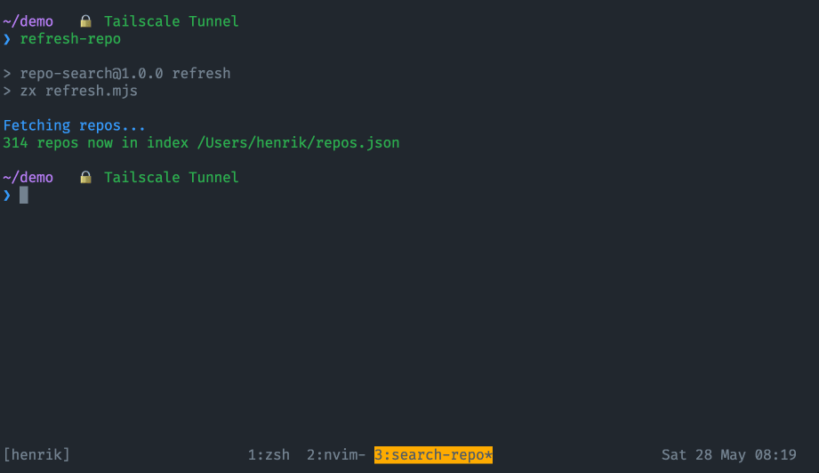

# Search Repository

This repository contains glue code for finding repositories on GitHub that you or your organisation owns. In short, it does the following:

1. Downloads metadata of all the repositories on GitHub associated with your account and saves a subset of the properties into ~/repos.json
2. Provides a way of searching that local file to quickly find a repo for cloning or opening the associated web page.

## Dependencies

- [BASH](<https://en.wikipedia.org/wiki/Bash_(Unix_shell)>)
- [GitHub CLI](https://cli.github.com/)
- [fzf](https://github.com/junegunn/fzf)
- [jq](https://stedolan.github.io/jq/)
- bat

Even though this is written using [🐚 zx](https://github.com/google/zx), that's not a direct dependency. It can be installed _either_ globally _or_ as a part of `npm install` in this repo.

## Installation

1. `npm install`
2. Add alias/function for invoking the npm scripts in this repo. I have the following in my `~/.zshrc`:

```
repo () {
  npm run search --prefix ~/kod/personligt/search-repo "$(pwd)"
}
o () {
  npm run open --prefix ~/kod/personligt/search-repo "${PWD##*/}" 1> /dev/null
}
alias refresh-repo="npm run refresh --prefix ~/kod/personligt/search-repo"
```

## Usage

There are two commands to run, one that fetches the repos' metadata and one that does the search. Having the aliases above loaded:

### Refreshing the local index

`$ refresh-repo`


### Searching

`$ repo`



### Open web for current repo/folder

`$ o`
